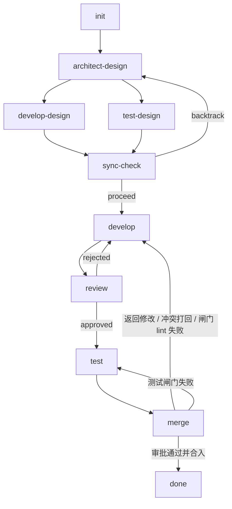

# 流程图、全局约束与配置

> 拆分自 agent-pipeline.md（原 §1–§3）。章节编号与决策编号保持拆分前不变，导读地图见 [README.md](README.md)。

## 1. 流程图

### 1.1 全局流程



> **并发说明：** `develop-design` 与 `test-design` 并行执行——各自一条独立游标（决策 80），两者都只读 `design.md`，互不依赖，一个分支阻塞不影响另一个跑完本阶段。sync-check 在两条游标都到达边界后汇聚判断（G5），之后进入 develop → review → test 串行链路。review 不通过则打回到 develop 形成循环。merge 时无法自动解决的冲突同样打回 develop；merge 的闸门失败按类型分流（决策 139）：测试失败回到 `test.execute` 重新分析根因（决策 85），lint 失败直接打回 `develop.execute`。

### 1.2 单阶段内部结构

每个阶段由 3 个节点组成，重试逻辑通过条件边处理：

```mermaid
graph TD
    validate_input -->|通过| execute
    validate_input -->|不充分| pending
    execute --> validate_output
    validate_output -->|通过| next_stage
    validate_output -->|不通过| execute
    validate_output -->|重试耗尽| pending
    pending -->|用户操作| 回到进入 pending 的节点
```

**条件边规则：**

| 源节点 | 条件 | 目标 | 说明 |
|---|---|---|---|
| validate_input | 输入充分 | execute | 正常流转 |
| validate_input | 输入不充分 | pending | 原因类型**按阶段定死**（决策 94）：`architect-design` → `info_insufficient`；`develop-design` / `test-design` → `user_decision`。路由函数负责带上 type，见 §5 |
| execute | 执行成功 | validate_output | 正常流转 |
| execute | 执行失败（节点级重试耗尽） | pending | timeout / agent 错误。先按 `agent_retry_max` 干净对话重试，耗尽才 pending（G13 / §11.4） |
| validate_output | 产出合格 | next_stage | 进入下一阶段 |
| validate_output | 产出不合格 | execute | 重试，prompt 追加反馈。`cross_family_judge = true` 时，agent 型 validate_output（architect-design / develop-design / test-design）首判不合格先经 `validator_cross_check` 伪阶段异族复判（决策 134）：复判也不合格才走上边打回；复判合格 → pending(user_decision, judge_disagreement) 由用户终审（决策 135），不经本表条件边 |
| validate_output | 重试耗尽 | pending | retry_exhausted |

> **节点集例外说明：**
> - `init` 无 validate_input，`done` 无 validate_output；
> - `merge` 无 validate_output（流转判断在 execute 内完成）；
> - `sync-check` 是纯代码逻辑，无 agent 调用，且**不占游标行**（决策 107）——它是游标无关的屏障，由 `advance_join` 在所有游标都到达边界后执行一次；
> - `develop` / `review` / `test` 跳过 validate_input（上游已完成输入充分性保证）；
> - `develop` / `test` 的 validate_output 为纯代码（执行测试 + 读元数据路由，见决策 62），`architect-design` / `develop-design` / `test-design` 的 validate_output 为 agent；
> - 不调 LLM 的节点（纯代码阶段 `init` / `sync-check` / `merge` / `done`，及 `develop` / `test` 的纯代码 `validate_output`）同样落 `kanban_node_runs` 行（`agent_type = "system"`，token 为 0，无会话行），见决策 99 / 114。

---

## 2. 全局约束

| # | 约束 | 说明 |
|---|---|---|
| G1 | 无状态节点 | 各节点不持有内部状态，产出写入任务目录文件，节点间通过文件路径传递信息 |
| G2 | 结构化流转 | 节点间流转的信息必须符合数据模型定义，不允许自由文本 |
| G3 | AGENTS.md 加载 | 每个 agent 启动时必须加载 `AGENTS.md` 获取项目上下文 |
| G4 | pending 展示 | 进入 pending 状态时，必须将当前阶段、当前节点、阻塞原因、已产出的信息展示给用户 |
| G5 | 并行汇合 | 下游阶段有多个前置时，所有前置游标都到达边界（`waiting_join`）且均无 pending，汇聚节点才执行且只执行一次。汇聚节点（`sync-check`）本身**不占游标行**（决策 107） |
| G6 | agent 预定义 | 每个阶段的 agent 必须提前定义好 provider、persona、tool、skill（§10.6），且不得削减系统最小基线 |
| G7 | 代码优先 | 固定流程（状态流转、数据组装、文件操作）通过代码实现；仅在需要语义分析/判断时接入 agent |
| G8 | 节点级恢复 | 进程中断后恢复到中断节点入口（checkpoint 粒度为节点级），节点内操作幂等 |
| G9 | 幂等要求 | 每个节点的写操作必须幂等：文件写入先清后写，数据库操作用 upsert |
| G10 | 任何节点可 pending | 不存在独立的 pending 列，任何节点都可因阻塞进入 pending，恢复后回到原节点继续 |
| G11 | 职责边界（**策略，非系统保证**） | 每个节点只应修改自己的产出（任务目录中的文档、worktree 中自己负责的代码文件），不得修改其他阶段的产出，不得跨任务修改任何文件。**强制范围仅限文件工具**（§12.14 的 `FileToolPolicy`）；shell 不受限，本约束在 shell 层面无法强制执行，只能靠 `kanban_node_commands` 审计事后发现（决策 104） |
| G12 | 工作目录显式告知 | agent 的 system prompt 和 user prompt 必须显式包含 worktree 和任务目录的**绝对路径**，不允许 agent 自行猜测路径 |
| G13 | 重试分层 | 工具调用失败在 agent loop 内重试（最多 `tool_retry_max` 次），节点级重试只处理 agent loop 整体失败；单次工具失败不得直接触发节点重试 |
| G14 | 减少 pending | pending 需要人工介入，成本高。设计时优先用自动重试/自动恢复解决，只有确实需要用户决策或补充信息时才进 pending |
| G15 | 独立 Graph | kanban 使用独立的 petgraph DAG 图，各阶段无长期记忆，节点级独立对话 |

---

## 3. 全局配置

| 参数 | 默认值 | 说明 |
|---|---|---|
| `validate_retry_max` | 3 | validate_output 重试 execute 的最大次数（当前阶段内） |
| `agent_retry_max` | 3 | 节点级 agent loop 整体失败时的最大重试次数（含元数据解析/校验失败、超时） |
| `tool_retry_max` | 3 | agent loop 内单次工具调用失败的最大重试次数 |
| `node_idle_timeout_sec` | 300 | 节点空闲超时（秒）：以流式 token / LLM 返回 / 工具与命令活动为心跳，无活动超过此值判定超时 |
| `node_max_duration_sec` | 1800 | 节点绝对时长上限（秒），即使持续有活动也不得超过，防不收敛循环 |
| `tool_timeout_sec` | 60 | 单次工具调用超时（秒） |
| `test_command_timeout_sec` | 600 | 系统执行的测试命令超时（秒），不受 `tool_timeout_sec` 限制 |
| `adaptive_timeout_enabled` | false | 自适应超时仅用于进度估算与告警，不改变强制阈值 |
| `pending_resume_cooldown_sec` | 5 | 用户 resume 后到开始执行下一节点之间的最小间隔，防止连续点击造成重复 resume |
| `pending_reminder_hours` | 24 | pending 超过此小时数未处理，重复提醒一次 |
| `pending_timeout_hours` | 72 | pending 超过此小时数自动标记 stalled，看板高亮 |
| `tick_interval_sec` | 10 | KanbanScheduler tick 周期（秒） |
| `conversation_max_chars` | 200000 | 单次会话 messages 落库的最大字符数，超出截断 |
| `conversation_retention_days` | 30 | 终态任务会话保留天数 |
| `offload_threshold_tokens` | 4000 | 工具结果超过此值卸载到文件，context 只留预览 + 路径。**与 `tool_result_max_tokens` 已合并为同一项**（决策 110）：不存在"被截断但从未卸载"的中间区间 |
| `context_soft_limit_ratio` | 0.6 | 触发压缩的阈值（占模型 context 窗口比例） |
| `keep_recent_rounds` | 5 | 压缩时保留最近 N 轮完整对话 |
| `context_hard_limit_ratio` | 0.9 | 硬上限，超过则强制压缩或降级模型 |
| `semantic_conflict_check` | true | 开启 architect 阶段的第二层语义冲突比对（§6） |
| `cross_family_judge` | false | 开启后 agent 型 validate_output 首判不合格时调用 `validator_cross_check` 伪阶段异族复判（决策 134 / 135）；开启但伪阶段未配置 provider → 配置加载 fail fast |
| `conflict_overlap_threshold` | 0 | `affected_files` 交集判定冲突的最小重叠文件数，0 表示任一交集即冲突 |
| `max_concurrent_tasks` | 5 | 同时执行的任务数上限（决策 21 / 36），在 scheduler `start_task` 处准入；名额占用 = `status ∈ {running, pending}`（决策 117） |
| `allow_dirty_worktree_merge` | false | 允许在目标分支工作区不干净时合入；false 时进入 pending 由用户决定 |
| `watch_event_window_minutes` | 30 | 值班长待办只收**这么新**的事件；同时是「同一任务在窗口内再次 pending」的计数窗口（决策 209②，票 05） |
| `watch_owner_stuck_minutes` | 10 | 判「卡住」的宽限：`scheduler_no_effect`（run 已终态而游标仍 active）与 `owner_stuck`（有主但心跳停了）都用它（票 05） |
| `watch_debounce_sec` | 60 | 值守轮的去抖窗口：窗口内攒批、到期唤醒一次；窗口内没有新事件则一次都不醒（票 06） |

> 阶段级 Agent 配置（provider / model 覆盖、prompt 覆盖、工具集等）不在本表，见 [agents.md](agents.md) §10.6。
